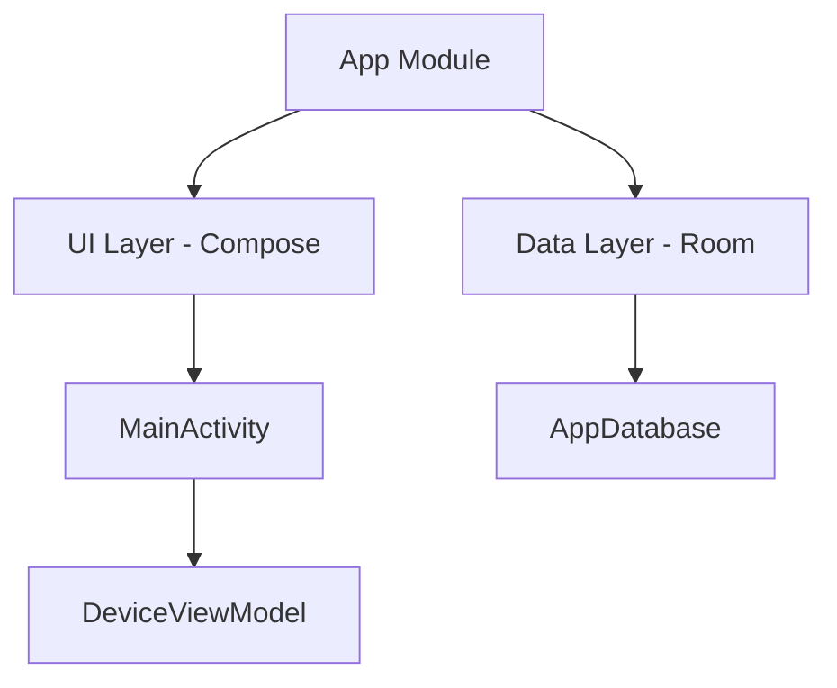

# 📱 Device Manager Project Dashboard

## 🚀 Live Status
- **Build Status**: ✅ Passing
- **Latest Sync**: ✅ Successful
- **Deployment**: 🏗️ Ready to Run on Device
- **Git Remote**: ✅ Connected & Pushed to [sangeeth25226/DeviceManager](https://github.com/sangeeth25226/DeviceManager)

## 📊 Project Overview

## 🛠️ Configuration Details
| Component | Version / Value |
| :--- | :--- |
| **Android Gradle Plugin** | 8.7.2 |
| **Gradle Wrapper** | 9.5.0 |
| **Kotlin** | 2.0.21 |
| **JDK** | 17 (Adoptium) |
| **Compile SDK** | 35 |
| **Namespace** | `com.yourcompany.devicemanager` |

## 📝 Roadmap & Tasks
- [x] Initial Project Setup
- [x] Resolve Gradle Sync Errors
- [x] Fix Environment Conflicts (ANDROID_USER_HOME)
- [x] Connect to Remote Repository
- [x] **Implement Device List UI** (Mock Data)
- [ ] **Next Up**: Implement Device Entity & DAO (Room Database)

## 📂 Repository Stats
- **Total Files**: ~50
- **Primary Language**: Kotlin
- **Architecture**: MVVM (Planned)

---
> [!TIP]
> **To update this dashboard**: Simply edit this file and commit the changes. GitHub will render the tables and Mermaid diagrams beautifully in your browser.
> 
> *Last Updated: 2026-09-02*
